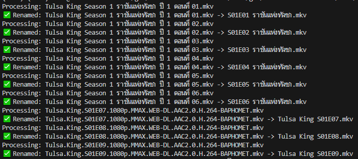

# MovieFilenameFomater

AutoPlexFormat is a Python script that automatically renames movie and TV show files into a **Plex-friendly format** using the OpenTyphoon AI API. It scans a directory, sends filenames to the API, and renames them according to standardized naming rules.



## Features
- **Automatic renaming** of movies and TV shows based on predefined rules
- **Removes unnecessary details** (e.g., resolution, encoding format, release groups)
- **Standardizes naming conventions** (`SXXEYY` for TV shows, `Movie Name (Year)` for movies)
- **Supports multiple video formats** (`.mp4`, `.mkv`, `.avi`, etc.)
- **Error handling** for API failures and renaming issues

## Installation
### Prerequisites
- Python 3.7+
- `requests` library (install using pip)

```sh
pip install requests
```

## Usage
### 1. Set Up Your API Key
Before running the script, you need to set your **OpenTyphoon API Key**.

#### **Option 1: Set Environment Variable (Recommended)**
```sh
export OPENTYPHOON_API_KEY="your_api_key_here"
```

#### **Option 2: Hardcode API Key (Not Recommended)**
Edit the script and replace `"YOUR_API_KEY"` with your actual key.

### 2. Run the Script
```sh
python rename_movies.py
```

### 3. File Renaming Example
#### **Before Running the Script:**
```
High.Potential.S01E01.Pilot.1080p.HS.WEB-DL.DDP5.1.H.264-MESSI@BearBIT.mkv
The.Dark.Knight.2008.2160p.UHD.BluRay.HDR.x265.mp4
```

#### **After Running the Script:**
```
High Potential S01E01.mkv
The Dark Knight (2008).mp4
```

## Configuration
Modify the script's settings:
- **Directory Path:** Edit the `DIRECTORY` variable to set the folder containing your media files.
- **Allowed File Types:** Adjust the `ALLOWED_EXTENSIONS` set if needed.

## Contributing
Feel free to open issues or submit pull requests!

## License
This project is licensed under the MIT License.

